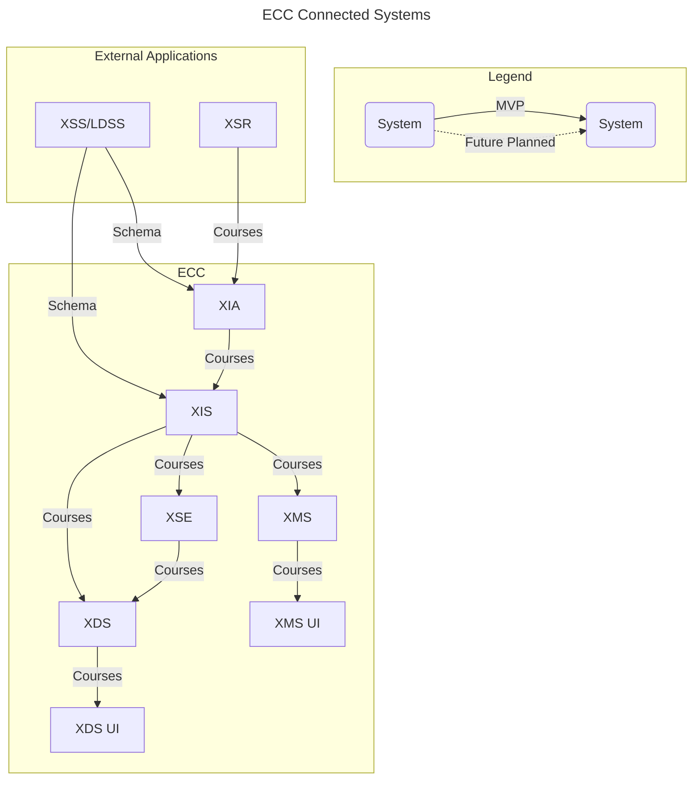

# OPENLXP-XIS - Experience Index Service 
The primary funnel for learning experience metadata collected by the Experience Indexing Agent (XIA) components.

XIS Component is the primary funnel for learning experience metadata collected by the XIA components. In addition, the XIS can receive supplemental learning experience metadata – field name/value overrides and augmentations – from the [Experience Management Service (XMS)](https://github.com/adlnet/ecc-openlxp-xms).

Learning experience metadata received from XIAs is stored in the Metadata Loading Area and processed asynchronously to enhance overall system performance and scalability. Processed metadata combined with supplemental metadata provided by an Experience Owner or Experience Manager and the "composite record" stored in the Metadata Repository. Metadata Repository records addition/modification events logged to a job queue, and the metadata is then sent to the Experience Search Engine (XSE) for indexing and high-performance location/retrieval.

XIS can syndicate its composite records to another XIS. One or more facets/dimensions can filter the record-set to transmit a subset of the overall composite record repository. In addition, the transmitted fieldset can be configured to contain redacted values for specified fields when information is considered too sensitive for syndication.

## ECC System Architecture



## Workflows
### ETL
ETL pipeline from XIA loads processed metadata ledger and supplemental ledger in a metadata ledger and supplemental ledger of XIS component after a validation. Metadata combined with supplemental metadata provided by an Experience Owner or Experience Manager from XMS also gets stored in XIS. All of them from XIA and XMS finally get merged into XIS's composite ledger after a validation.  

Composite metadata is then sent to an XSE for further discovery.

### Upstream Syndication
Upstream Syndication allows for connecting the current XIS to another XIS in order to retrieve experiences.  Running the Upstream Syndication workflow, triggers a task to iterate over all XIS Upstream configurations that have an active status.  The task retrieves all Composite Ledger experiences from the remote XIS and attempts to load them into the local Metadata and Supplemental Ledgers.  If the incoming data doesn't match the locally set schema, or would otherwise fail being uploaded, it isn't saved.

### Downstream Syndication
Downstream Syndication allows for connecting the current XIS to another XIS in order to send experiences.  Running the Downstream Syndication workflow, triggers a task to iterate over all XIS Downstream configurations that have an active status.  The task retrieves all Composite Ledger experiences from the local XIS and performs any filters on the records and metadata.  It then attempts to load them into the remote's Metadata and Supplemental Ledgers using the managed-data API.  If the outgoing data doesn't match the remote schema, or would otherwise fail being uploaded, it will not be saved.


## Prerequisites
### Install Docker & docker-compose
#### Windows & MacOS
- Download and install [Docker Desktop](https://www.docker.com/products/docker-desktop) (docker compose included)


#### Linux
You can download Docker Compose binaries from the
[release page](https://github.com/docker/compose/releases) on this repository.

Rename the relevant binary for your OS to `docker-compose` and copy it to `$HOME/.docker/cli-plugins`

Or copy it into one of these folders to install it system-wide:

* `/usr/local/lib/docker/cli-plugins` OR `/usr/local/libexec/docker/cli-plugins`
* `/usr/lib/docker/cli-plugins` OR `/usr/libexec/docker/cli-plugins`

(might require making the downloaded file executable with `chmod +x`)

### Python
`Python >=3.9` : Download and install it from here [Python](https://www.python.org/downloads/).


## Clone the project
Clone the Github repository
```
git clone https://github.com/OpenLXP/openlxp-xis.git
```  

## Set up your environment variables
- Create a `.env` file in the root directory
- The following environment variables are required:

| Environment Variable      | Description                                                                                                                 |
| ------------------------- | --------------------------------------------------------------------------------------------------------------------------- |
| AWS_ACCESS_KEY_ID         | The Access Key ID for AWS                                                                                                   |
| AWS_SECRET_ACCESS_KEY     | The Secret Access Key for AWS                                                                                               |
| AWS_DEFAULT_REGION        | The region for AWS                                                                                                          |
| CELERY_BROKER_URL         | The URL of the message broker that Celery will use to send and receive messages                                             |
| CELERY_RESULT_BACKEND     | The backend that Celery will use to store task results                                                                      |
| DB_HOST                   | The host name, IP, or docker container name of the database                                                                 |
| DB_NAME                   | The name to give the database                                                                                               |
| DB_PASSWORD               | The password for the user to access the database                                                                            |
| DB_ROOT_PASSWORD          | The password for the root user to access the database, should be the same as `DB_PASSWORD` if using the root user           |
| DB_USER                   | The name of the user to use when connecting to the database. When testing use root to allow the creation of a test database |
| DJANGO_SUPERUSER_EMAIL    | The email of the superuser that will be created in the application                                                          |
| DJANGO_SUPERUSER_PASSWORD | The password of the superuser that will be created in the application                                                       |
| DJANGO_SUPERUSER_USERNAME | The username of the superuser that will be created in the application                                                       |
| LOG_PATH                  | The path to the log file to use                                                                                             |
| SECRET_KEY_VAL            | The Secret Key for Django                                                                                                   |

## Deployment
1. Create the openlxp docker network
    Open a terminal and run the following command in the root directory of the project.
    ```
    docker network create openlxp
    ```

2. Run the command below to deploy XIS from `docker-compose.yaml` 
    ```
    docker-compose up -d --build

## Configuration for XIS
1. 1. Navigate over to `http://localhost:8080/admin/` in your browser and login to the Django Admin page with the admin credentials set in your `.env` (`DJANGO_SUPERUSER_EMAIL` & `DJANGO_SUPERUSER_PASSWORD`)

2. <u>CORE</u>
    - Configure Experience Index Service (XIS)
        1. Click on `Xis configurations` > `Add Xis configuration`
             - Enter configurations below:
                - Under XSS Settings, add the `Xss host`. The host is the hostname/port of XSS instance. The `Target schema`: Schema name or iri for target validation schema from XSS

                - Under XSE Settings, add the `Xse host` & `Xse index`.  The host is the hostname/port of XSE and the index is the index of data to use on the XSE instance. The `Autocomplete field` is the path to the field to use for autocomplete in XSE. The `Filter field` is the Path to the field to use for filtering in XSE.
        
            **Note: Please make sure to upload schema file in the Experience Schema Server (XSS).**
    - Configure Upstream XIS Syndication
        1. Click on `Xis upstreams` > `Add Xis upstream`
            - Enter configurations below:
                - `Xis api endpoint` is the api of the XIS Instance to retrieve data from. 
                - `Xis api endpoint status` is whether or not you'd like to connect to this XIS Instance for syndication.
    
    - Configure Record Filter for XIS Downstream Syndication
        1. Click on `Add Filter records` > `Add filter record`
            - Enter configurations below:
                - `Field name`: The path to the field to check
                - `Comparator`: The type of comparison to make (equal, not equal, contains)
                - `Field value`: The value to check the field for

    - Configure Metadata Filter for XIS Downstream Syndication
        1. Click on `Filter metadatas` > `Add filter metadata`
            - Enter the configurations below:
                - `Field name`: The path to the field
                - `Operation`: Whether to include or exclude the selected field

    - Configure XIS Downstream Syndication
        1. Click on `Xis downstreams` > `Add xis downstream`
            - Enter the configurations below:
                - `Xis api endpoint`: The api of the XIS Instance to retrieve data from
                - `Xis api endpoint status`: Whether to connect to this XIS Instance for syndication
                - `Filter records`: The filter record objects to use when filtering records to send to this XIS
                - `Filter metadata`: The filter metadata objects to use when filtering metadata to send to this XIS

3. <u>OPENLXP_NOTIFICATIONS</u>
    - Templates: Create customized email template content. (default template - edlm-status-update)
        1. Click on `Templates` > `Add template`
            - Enter the configurations below:

                - `Template Type`:  Add a reference name for the Template.
                - `message`: Add the email content here.

                    **Note: Add content formatted as HTML here. You can add the following variables in the content.**

                    {name:}
                    {date_time:}

    - Subjects:  Add the subject line for the email notification. (default subject line "OpenLXP Conformance Alerts" will be set)
        1. Click on `Subjects` > `Add subject`

    - Recipients 
        - Click on `Recipients` > `Add recipient` 
            - Enter configurations below:

                - `First name` 
                
                - `Last name`
                
                - `Email address`: (Needs to be verified in SES) 

    - Emails: Set up the configurations for email notifications. (default email configuration - Status_update)
        1. click on `Emails` > `Add email`

            - Enter the configurations below:

                - `Sender`:  Add the sender email address from where notification alerts originate.

                - `Reference`:  Add a reference name for the Email configuration.

                - `Subject`: Select a 'subject' from the drop down options set up previously.

                - `Recipient`: Select all recipients from the list.

                - `Template`: Select a 'template' from the drop down options set up previously.        

## Running Of XIS Tasks:

### Running Tasks
XIS has 3 workflows that can be run.  Consolidation and loading of Metadata and Supplemental Metadata into Compositing Ledger then loading it into XSE.  XIS Upstream Syndication.  And XIS Downstream Syndication.  They can each be triggered 2 ways:

1. Through API Endpoints:
    - For consolidating records to the Composite Ledger and loading it into XSE:
        ```
        http://localhost:8080/api/xis-workflow
        ```

    - For Upstream Syndication:
        ```
        http://localhost:8080/api/upstream-workflow
        ```

    - For Downstream Syndication:
        ```
        http://localhost:8080/api/downstream-workflow
        ```

2. Periodically through celery beat: 

    On the Django admin page, click `Periodic tasks` >  `Add periodic task`. Here you can schedule celery beat to periodically run the workflows for you. To do so, enter the configurations below:
        - `Name` - Short description for this task
        - `Task (registered)`: The workflow to run from the Task (registered) dropdown list.  On the selected time interval celery task will run the task.

## Removing Deployment
To destroy the created resources, simply run the command below in your terminal:
    
    
    docker compose down

## API's 

XIS supports API's endpoints which can get called from other components

1. `/api/catalogs/`
    
    This API fetches the names of all course providers in the composite ledger

2. `/api/metadata/`
    
    This API is for uploading metadata ledger records

3. `/api/supplemental-data/`
    
    This API is for uploading supplemental ledger records

4. `/api/metadata/<str:course_id>/`
    
    This API fetches the composite ledger object

5. `/api/managed-data/catalogs/`
    
    This API fetches the names of all course providers in the metadata ledger

6. `/api/managed-data/catalogs/<str:provider_id>`
    
    This API fetches the metadata and supplemental ledger data under a specific catalog/course provider

7. `/api/managed-data/catalogs/<str:provider_id>/<str:course_id>/`
    
    This API fetches or modifies the record of the corresponding course id

## Logs
To check the running of celery tasks, check the logs of application and celery container.


## Troubleshooting
- If the container builds but crashes or logs an error of unrecognized commands, the issue is usually incorrect line endings. Most IDEs/Text Editors allow changing the line endings, but the dos2unix utility can also be used to change the line endings of `start-app.sh` and `start-server.sh` to LF.


- A good basic troubleshooting step is to use `docker-compose down` and then `docker-compose up --build` to rebuild the app image; however, this will delete everything in the database.

## License
 This project uses the [Apache](http://www.apache.org/licenses/LICENSE-2.0) license.
  
